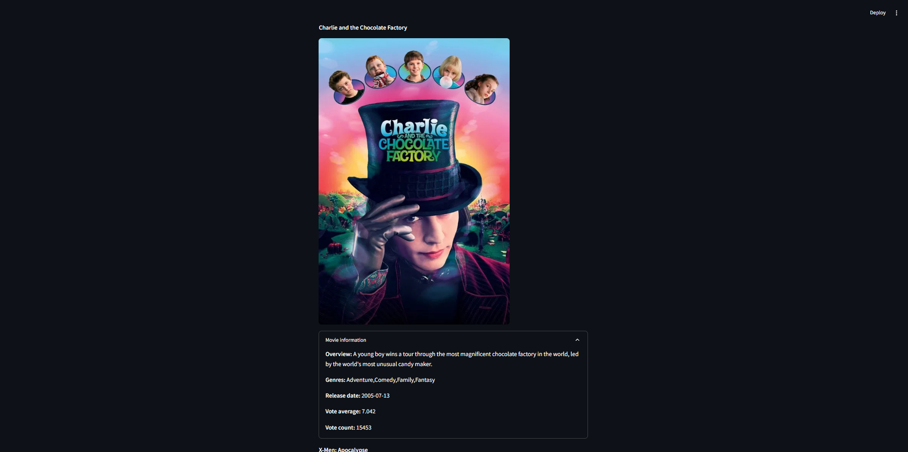

# Movies Recommendation System

- [Description](#description)
- [Prerequisites](#prerequisites)
- [Installation](#installation)
- [Usage](#usage)
- [Contributing](#contributing)

## Description
This is a project for the subject Artificial Intelligence in Marketing. The goal of this project is to collect movie data from the TMDB API, process it, and build a recommendation system using content-based filtering. Finally, the system visualizes and displays information for movies similar to the input movie.



## Prerequisites

1. Python
2. TMDB API_KEY. Sign up at [TMDB page](https://www.themoviedb.org/signup).

## Installation

### 1. Clone the Repository

```bash
git clone https://github.com/truongvude/recommendation_system.git
cd recommendation_system
```

### 2. Set up a Virtual Environment:

```bash
python -m venv .venv
source .venv/bin/activate   # For Unix/macOS
# or
.venv\Scripts\activate      # For Windows
```

### 3. Install Dependencies
```bash
pip install -r requirements.txt
```

### 4. Configure Environment Variables
Create your .env file using the provided example:
```bash
mv .env_example .env
```
Then open .env and insert your TMDB API key:
```bash
nano .env   # Or use any text editor of your choice
```

## Usage

### 1. Run `main.py`

```bash
python3 main.py
```

### 2. Run app.py with Streamlit
```bash
streamlit run app.py
```

## Contributing

Pull requests are welcome. For major changes, please open an issue first
to discuss what you would like to change.

Please make sure to update tests as appropriate.